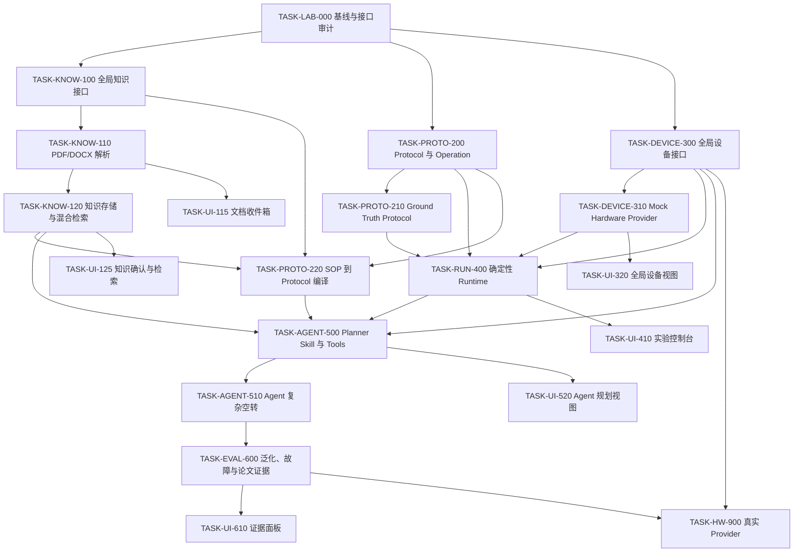

# 自动化实验室 MVP 开发编排计划

本文是 [实施方案](实施方案.md) 的执行入口，规定开发顺序、任务依赖、每块交付物和退出条件。架构职责、证据边界和领域概念由实施方案定义；本文不重复其完整说明。

## 1. 交付目标

开发以空间 ATAC 复杂空转为首个 Benchmark，依次形成四个可独立演示的里程碑：

1. 已批准的 Ground Truth Plan 可以通过确定性 Runtime 和 Mock Hardware Provider 完整执行。
2. PDF/DOCX 可以转换为带页码、区块和版本来源的知识，确认后的事实可以编译为 ProtocolDefinition。
3. Planner Agent 可以使用全局知识、Protocol、LabOperation 和全局设备能力完成复杂模拟空转。
4. 系统可以复现故障注入、Protocol 变体和同能力设备替换，并从事件生成论文指标。

真实设备 Provider 和物理空转属于后续里程碑，不阻塞软件 MVP。

## 2. 固定技术决策

- DeepSeek Harness 提供 Agent、Tool、Session、Skill、Jobs、审批、Web 和插件组合基础设施，不修改 `agent-loop`。
- 原始 PDF/DOCX 是不可变证据；解析结果、知识事实、索引和 Protocol 分别版本化。
- 全局 Knowledge Service 统一提供文档导入和检索，数据按权限范围、知识类型、实验类型、设备、版本和状态区分。
- 权限和有效状态使用硬过滤；知识类型和实验上下文用于检索路由，结果不足时扩大检索范围，避免硬分区降低召回率。
- Harness Skill 只提供 Agent 指令。SOP 的执行事实保存为 ProtocolDefinition；固定可执行能力保存为 LabOperation；不得把 `SKILL.md` 当作 SOP 数据库或设备驱动。
- ExecutionGraph 是一次实验的运行产物，不建设 Workflow Library。`dsh-workflow` 只允许用于短时多 Agent 规划、复核或报告，不持有实验运行状态。
- Global Device Service 统一注册设备、能力、状态和租约。Agent 可以查询设备和提出计划，只有 LabRunService 可以提交设备命令。
- Mock 和真实 Provider 实现相同的 Device Service、命令、状态和回执语义；模拟证据标记为 `SIMULATED`。
- MVP 使用本地文件保存原始文档，使用 Provider 自有 SQLite 保存知识元数据、事实、FTS 和索引版本；上层只依赖 Knowledge Service，后续可替换为 PostgreSQL 与向量 Provider。
- Python 文档解析实现为可配置模块和 Provider，不设计成面向用户的命令行脚本。
- 开发采用 2–5 个工作日的纵向切片；每个切片同时交付最小 Service、Provider、Consumer/UI、失败路径和演示数据，禁止连续建设多个无界面的后端层后再集中集成。

## 3. 目标模块

模块名在 TASK-LAB-000 中核对仓库命名和聚合规则后确认；禁止在基线完成前创建空包。

| 模块 | 角色 | 责任 |
| --- | --- | --- |
| `lab-protocol` | 普通领域包 | ProtocolDefinition、ExperimentPlan、LabOperation 引用、规则、单位、来源和校验 |
| `lab-knowledge` | Service Definition | 全局文档导入、知识事实、作用域检索、冲突和确认接口 |
| `lab-knowledge-local` | Service Provider | 原始文件、Docling、SQLite、FTS、Embedding 接口、混合检索和索引重建 |
| `tool-lab-knowledge` | Consumer | 文档导入状态、知识检索、冲突检查和事实确认工具 |
| `lab-device` | Service Definition | 全局 Device Registry、Capability、状态、租约、命令、回执和停止语义 |
| `lab-device-mock` | Service Provider | 可配置 Mock 设备、结构化模拟回执和故障注入 |
| `lab-runtime` | Service Provider | ExecutionGraph、单运行状态机、依赖推进、人工等待、安全停止和事件 |
| `tool-lab` | Consumer | Protocol、Plan、Run、状态、确认、停止和报告工具 |
| `lab-mvp` | Bundle | 显式组合知识、Protocol、Mock 设备、Runtime、Tools 和 Planner Skill |
| `lab-mvp-web` | Consumer | 文档、知识确认、计划审批、实验运行、设备状态、Agent 决策和证据视图 |

## 4. 数据流

```text
PDF / DOCX
  → 不可变文件与 SHA-256
  → Document IR（段落、表格、页码、坐标、标题路径）
  → 结构化知识候选与冲突
  → 人工确认
  → 全局 Knowledge Service
  → ProtocolDefinition
  → Planner Agent + Harness Skill
  → ExperimentPlan
  → 确定性校验
  → ExecutionGraph
  → LabRunService
  → Global Device Service + Lease
  → Mock / Real Provider
  → Observation / QC / Session Events
  → 报告与论文指标
```

## 5. 任务依赖图



## 6. 执行顺序

### 6.1 敏捷交付节奏

波次表示依赖关系，不要求先完成整层后端再进入下一层。实际开发按纵向增量推进，每个增量结束时必须能从现有 Web 界面操作真实 Service 路径并演示一个新增结果。

| 增量 | 建议周期 | 可演示结果 |
| --- | --- | --- |
| I0 基线 | 1–2 天 | 接口地图、页面地图、真实样本与首个 Mock 能力清单 |
| I1 Walking Skeleton | 2–4 天 | opt-in bundle 启动；最小 Protocol、一个 Mock 设备、三节点运行和通用工具卡可见 |
| I2 文档入口 | 3–5 天 | 上传一份 DOCX/PDF，查看解析状态、页码区块和失败结果 |
| I3 知识到 Protocol | 3–5 天 | 分类检索、事实确认、冲突处理并生成带来源的 Protocol 候选 |
| I4 复杂确定性空转 | 4–5 天 | 完整 Ground Truth、全部 Mock 能力、设备视图和实验控制台运行 |
| I5 Agent 闭环 | 4–5 天 | Agent 检索知识、规划、修复、批准并启动复杂空转 |
| I6 论文证据 | 3–5 天 | 故障、变体、设备替换、召回指标和证据面板 |

任务预计超过 5 个工作日或同时修改两个独立能力时，必须拆成带后缀的可验收子任务，例如 `TASK-KNOW-120A` 和 `TASK-KNOW-120B`。拆分不能改变公共接口责任或绕过原任务依赖。

每个增量遵循同一反馈循环：

```text
选择一个用户可观察目标
→ 定义最小接口和失败语义
→ 实现真实 Provider 路径
→ 接入最小 Consumer / UI
→ 用固定样本完成演示
→ 记录反馈和指标
→ 收紧下一增量范围
```

增量完成条件：

- opt-in composition 可以启动，新增能力不修改默认 profile。
- UI 和 Agent Tool 调用真实 Service，不在浏览器维护第二份业务状态或使用定时动画伪造完成。
- 至少覆盖一个成功路径和一个用户可见失败路径。
- 模型或用户可见行为具有真实 composition snapshot；核心状态具有聚焦测试。
- 提供固定演示数据和两分钟内可完成的验收步骤。
- 未完成能力保持显式不可用，不添加静默占位或虚假成功状态。

### 波次 0：基线锁定

#### TASK-LAB-000：仓库、资料和接口基线

输入：仓库规则、架构文档、空间 ATAC CSV、全流程 HTML、实施方案和 simple 方案。

输出：

```text
docs/change_plan/implementation/00-repository-baseline.md
docs/change_plan/implementation/01-protocol-audit.md
docs/change_plan/implementation/02-knowledge-interface.md
docs/change_plan/implementation/03-device-interface.md
docs/change_plan/implementation/04-harness-reuse-map.md
docs/change_plan/implementation/05-package-map.md
docs/change_plan/implementation/06-ui-slice-map.md
```

验收：每个新增能力标明 Service Definition、Provider、Consumer 或普通领域包；CSV 缺失步骤、异常命名、待确认字段和硬件未知项均有处理状态；列出第一批 PDF/DOCX 解析样本和 Mock 设备能力。

非目标：不创建业务包，不运行真实设备，不选择生产数据库，不安装新依赖。

### 波次 1：三条基础接口

#### TASK-KNOW-100：全局 Knowledge Service

依赖：TASK-LAB-000。

定义 Document、DocumentVersion、ParseRun、DocumentBlock、KnowledgeFact、KnowledgeScope、KnowledgeType、Citation、Conflict 和 SearchResult。接口覆盖文件登记、导入状态、事实确认、混合检索和索引版本；权限范围与知识类型独立建模。

验收：Service Definition、失败码、取消语义、来源字段和 Provider/Consumer 测试契约完整；全局可发现不绕过作用域授权。

#### TASK-PROTO-200：Protocol、Plan 与 LabOperation

依赖：TASK-LAB-000。

定义 ProtocolDefinition、ExperimentPlan、ProtocolStep、LabOperationDefinition、规则、单位、来源、确认状态和 ExecutionGraph 输入。Harness Skill 不出现在执行类型中。

验收：未知字段、缺失单位、依赖缺失、环、未知 Operation、未确认真实参数和无来源执行步骤均被拒绝。

#### TASK-DEVICE-300：全局 Device Service

依赖：TASK-LAB-000。

定义 Device、Capability、DeviceState、Reservation、DeviceCommand、DeviceReceipt、幂等键、健康检查、查询、执行和停止。设备目录全局共享；动态状态和租约由服务统一管理。

验收：同一设备不能被两个有效租约同时占用；无租约、过期租约、参数越界、重复幂等键和未知 Capability 行为明确；凭证不进入事件。

### 波次 2：确定性骨架与知识导入

#### TASK-PROTO-210：空间 ATAC Ground Truth Protocol

依赖：TASK-PROTO-200。

将 CSV 转换为带来源和确认状态的 ProtocolDefinition。缺失 `3-6` 和 `3-5` 异常名称形成显式修复记录；所有设备步骤映射到 Capability 和 LabOperation。

验收：完整依赖图、三个分支和人工节点可加载；模拟假设进入报告；真实模式拒绝未确认参数。

#### TASK-DEVICE-310：Mock Hardware Provider

依赖：TASK-DEVICE-300。

实现当前实验需要的设备角色、状态序列、参数范围、租约检查、结构化模拟回执及 `BUSY`、`DELAY`、`OFFLINE`、`TIMEOUT`、`REJECTED`、`FAILED` 场景。

验收：所有行为通过正式 Device Service 路径；相同幂等键不产生第二次动作；报告强制标记 `SIMULATED`。

#### TASK-KNOW-110：PDF/DOCX 解析 Provider

依赖：TASK-KNOW-100。

以 Docling SDK 构建可配置解析 Provider，保存原始文件哈希、Parser 版本、段落、表格、页码、坐标、标题路径和 OCR 来源。受密码保护、损坏、无文本层和不支持格式具有明确状态。

验收：至少一份 DOCX、一份文本 PDF、一份扫描 PDF 和一份含表格文档进入 Document IR；重新导入相同哈希保持幂等；失败不产生 ACTIVE 文档。

#### TASK-UI-115：文档收件箱

依赖：TASK-KNOW-110。

在现有 Web Client 中实现 PDF/DOCX 上传、文档版本、解析状态、失败原因和页码/区块预览。页面只使用 Knowledge Service，不读取 Parser 临时文件或数据库。

验收：真实 DOCX 和 PDF 可上传并看到解析结果；损坏或受密码保护文件显示明确失败；刷新后状态来自 Provider。

#### TASK-UI-320：全局设备视图

依赖：TASK-DEVICE-310。

展示全局设备、Capability、Provider 类型、在线状态、当前租约和占用运行。第一版只读，不提供绕过 LabRunService 的执行按钮。

验收：Mock 设备状态和租约变化来自 Device Service；离线和忙碌具有明确状态；浏览器不保存权威设备状态。


#### TASK-RUN-400：确定性 Runtime

依赖：TASK-PROTO-210、TASK-DEVICE-300、TASK-DEVICE-310。

实现单活动运行、ExecutionGraph 依赖推进、设备租约、人工等待、安全停止、取消、报告和 Session 事件。Runtime 不调用 LLM，也不直接读取 SOP 文档。

验收：Ground Truth Plan 在无 Agent 条件下完成正常空转；离线、超时、拒绝和人工拒绝不会推进后继节点；进程遗留运行投影为 `RECOVERY_REQUIRED`。
#### TASK-UI-410：实验控制台

依赖：TASK-RUN-400。

实现 Protocol/Plan 审查、未确认项、批准、运行时间线、人工节点、暂停、停止、设备回执和证据模式。操作通过 Tool/API Consumer 进入 Runtime。

验收：三节点和完整 Ground Truth 都可从页面启动和观察；人工拒绝、设备超时和停止不会显示为成功；刷新后状态由事件投影恢复。


里程碑 M1：确定性复杂模拟空转。

### 波次 3：知识沉淀与 SOP 编译

#### TASK-KNOW-120：知识存储与混合检索

依赖：TASK-KNOW-110。

实现 Provider 自有 SQLite、原始文件引用、Document IR、事实状态、FTS、Embedding Provider 接口、索引版本和混合检索。权限与 `CONFIRMED` 状态使用硬过滤；知识类型和实验上下文用于路由；结果不足时扩大范围并统一重排。

验收：检索结果携带文档版本、页码、区块和原文引用；删除派生索引后可以重建；索引失败不改变权威事实；测试覆盖分类路由命中和跨分类回退。

#### TASK-UI-125：知识确认与检索

依赖：TASK-KNOW-120。

实现知识范围和类型筛选、混合检索结果、原文引用、事实确认、冲突裁决和索引状态。分类是检索路由，不隐藏权限允许的跨类回退结果。

验收：用户可以从检索结果跳转到页码/区块；确认和拒绝形成持久事实状态；索引失败不改变已确认事实。

#### TASK-PROTO-220：SOP 到 Protocol 编译

依赖：TASK-KNOW-120、TASK-PROTO-200。

从确认事实生成 ProtocolDefinition 候选，登记冲突、未知值和来源。Agent 可以提出字段映射，确定性编译器负责类型、引用和约束校验；未确认候选不能进入物理执行。

验收：从真实 PDF/DOCX 样本生成与 Ground Truth 可比较的 Protocol；每个步骤、参数和规则可回溯到来源；冲突不会被模型静默覆盖。

里程碑 M2：文档到可执行 Protocol 的可追溯链路。

### 波次 4：Agent 驱动闭环

#### TASK-AGENT-500：Planner Skill 与 Agent Tools

依赖：TASK-KNOW-120、TASK-PROTO-220、TASK-DEVICE-300、TASK-RUN-400。

Planner Skill 说明知识检索、Protocol 加载、Capability 查询、计划生成、修复和批准规则。Tools 只暴露结构化知识、计划、运行和报告操作；Agent 无原始数据库、文件系统、设备驱动和任意脚本权限。

验收：模型可见输入全部可由 Session 日志重建；计划输出在工具边界校验；知识引用、Protocol 版本、Operation 和设备能力进入计划记录；keyless snapshot 覆盖成功与拒绝路径。

#### TASK-UI-520：Agent 规划视图

依赖：TASK-AGENT-500。

展示 Agent 使用的知识引用、Protocol 版本、Capability 选择、计划修复、Validator 结果和批准请求，不展示内部推理文本。

验收：所有显示内容来自已记录事件或工具结果；计划被拒绝时原因可定位到字段和来源；页面不能直接修改 Runtime 状态。

#### TASK-AGENT-510：Agent 复杂空转

依赖：TASK-AGENT-500。

Agent 从用户请求开始，检索知识、选择 Protocol、查询设备、生成计划、修复校验错误、请求批准并启动完整空间 ATAC Mock 空转。

验收：连续三次运行无需开发者修改代码或状态；除明确人工节点外全部设备步骤来自 Mock Provider 回执；报告包含知识来源、计划、设备、异常和证据模式。

里程碑 M3：Agent 驱动自动实验平台软件闭环。

### 波次 5：泛化与论文证据

#### TASK-EVAL-600：故障、泛化和指标

依赖：TASK-AGENT-510。

执行参数变化、步骤删减、分支变化、同 Capability 设备替换、知识分区检索和故障注入；比较 LLM-only、LLM + Validator、Full System。

验收：指标由运行事件和检索记录生成；保留失败样本；输出规划通过率、非法操作拦截率、知识召回、引用准确率、运行完成率、人工介入、故障后错误推进次数和 Runtime 改动量。

里程碑 M4：论文和融资演示证据包。

#### TASK-UI-610：论文证据面板

依赖：TASK-EVAL-600。

展示复杂空转、故障、Protocol 变体、设备替换、知识召回、引用准确率、人工介入和消融结果，并区分 `SIMULATED`、`MANUAL` 和 `PHYSICAL`。

验收：所有数字可回溯到运行、检索记录和评估配置；失败样本可见；页面不计算另一套不可复现指标。

### 后续：真实硬件

#### TASK-HW-900：真实 Device Provider 与物理空转

依赖：TASK-EVAL-600 和设备协议。

按设备型号实现 Provider，复用 Device Service 兼容性测试并增加厂商安全测试。替换 Provider 时 ProtocolDefinition、ExperimentPlan、LabOperation、Runtime 和 Agent Tools 不修改。

## 7. Codex 每轮执行规则

1. 每轮只执行一个 Task 或已登记的子任务；单项预计超过 5 个工作日必须先拆分，不得自动越过未满足的依赖。
2. 开始前阅读适用的 `AGENTS.md`、架构文档、目标包 README、相关 Agent Note 和本文件任务卡。
3. 先检查工作区并保护用户改动；只修改任务声明的文件范围。
4. 非平凡代码变更在同一任务中新增或更新 Agent Note。
5. 先定义 Service Definition、失败语义、事件和配置，再实现 Provider 与 Consumer。
6. Service 的首个可用切片同步接入最小 Consumer 或 UI；界面不得使用硬编码业务状态替代未完成后端。
7. Python 解析代码通过配置对象或模块 API 接收参数，不默认创建面向用户的 CLI。
8. 模型或用户可见行为必须通过真实 runnable composition 添加 keyless snapshot；包测试不能代替。
9. 只运行覆盖当前差异的最小检查；不得因文档检查自行触发依赖安装或 Git hook 安装。
10. 任务完成后演示一个用户可观察结果，并输出 Outcome、文件、公共接口、实际检查、未关闭风险和下一可执行 Task，然后停止。

## 8. 任务状态记录

状态只在本表维护，详细设计和验证证据进入对应 Task 输出或代码所有者文档。

| Task | 状态 | 依赖 | 下一动作 |
| --- | --- | --- | --- |
| TASK-LAB-000 | READY | 无 | 生成七份基线审计文档 |
| TASK-KNOW-100 | BLOCKED | TASK-LAB-000 | 定义全局知识接口 |
| TASK-PROTO-200 | BLOCKED | TASK-LAB-000 | 定义 Protocol 与 LabOperation |
| TASK-DEVICE-300 | BLOCKED | TASK-LAB-000 | 定义全局设备与租约接口 |
| TASK-KNOW-110 | BLOCKED | TASK-KNOW-100 | 实现 PDF/DOCX 解析 |
| TASK-UI-115 | BLOCKED | TASK-KNOW-110 | 实现文档收件箱 |
| TASK-PROTO-210 | BLOCKED | TASK-PROTO-200 | 数字化空间 ATAC Ground Truth |
| TASK-DEVICE-310 | BLOCKED | TASK-DEVICE-300 | 实现 Mock Hardware Provider |
| TASK-UI-320 | BLOCKED | TASK-DEVICE-310 | 实现全局设备视图 |
| TASK-RUN-400 | BLOCKED | TASK-PROTO-210、TASK-DEVICE-300、TASK-DEVICE-310 | 实现确定性 Runtime |
| TASK-UI-410 | BLOCKED | TASK-RUN-400 | 实现实验控制台 |
| TASK-KNOW-120 | BLOCKED | TASK-KNOW-110 | 实现知识存储与混合检索 |
| TASK-UI-125 | BLOCKED | TASK-KNOW-120 | 实现知识确认与检索 |
| TASK-PROTO-220 | BLOCKED | TASK-KNOW-120、TASK-PROTO-200 | 实现 SOP 编译 |
| TASK-AGENT-500 | BLOCKED | TASK-KNOW-120、TASK-PROTO-220、TASK-DEVICE-300、TASK-RUN-400 | 实现 Agent 集成 |
| TASK-UI-520 | BLOCKED | TASK-AGENT-500 | 实现 Agent 规划视图 |
| TASK-AGENT-510 | BLOCKED | TASK-AGENT-500 | 运行 Agent 复杂空转 |
| TASK-EVAL-600 | BLOCKED | TASK-AGENT-510 | 生成论文证据 |
| TASK-UI-610 | BLOCKED | TASK-EVAL-600 | 实现论文证据面板 |
| TASK-HW-900 | DEFERRED | TASK-EVAL-600、设备协议 | 接入真实设备 |

## 9. 第一开发块

下一轮只执行 TASK-LAB-000。完成七份基线文档后，TASK-KNOW-100、TASK-PROTO-200 和 TASK-DEVICE-300 才能进入 READY；没有用户明确要求时不同时创建三个能力包。首个代码增量以 Walking Skeleton 为目标，必须同时提供可启动 composition、三节点运行和最小可见结果。
